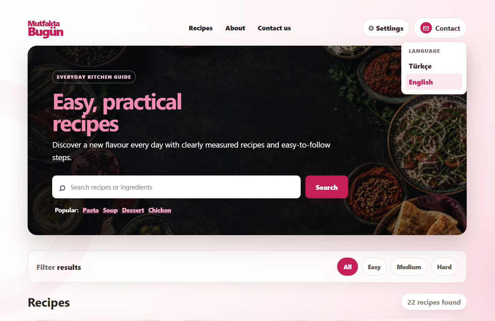
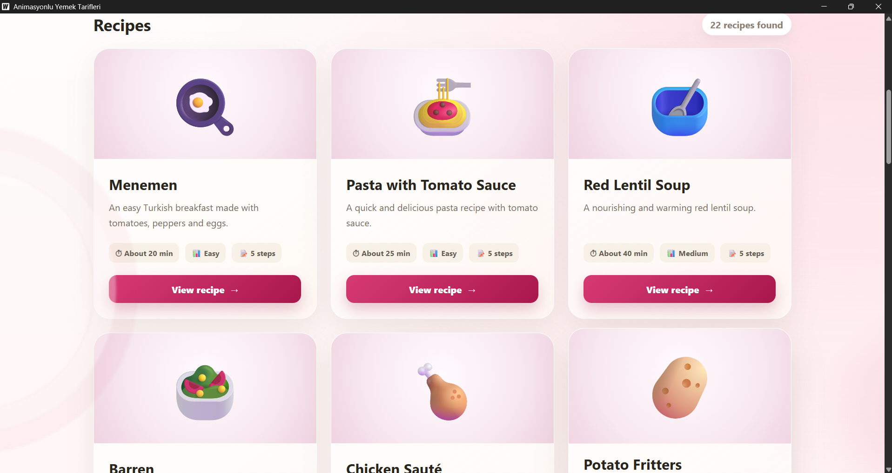
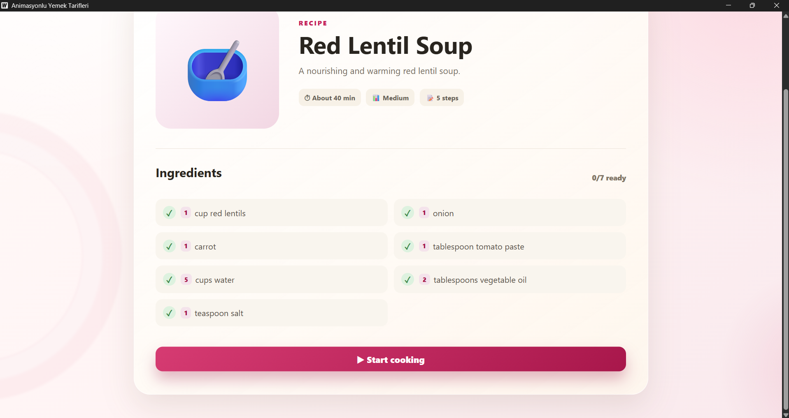
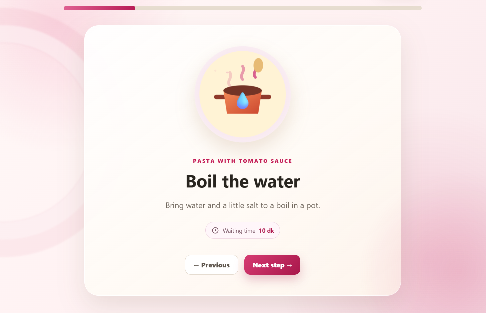
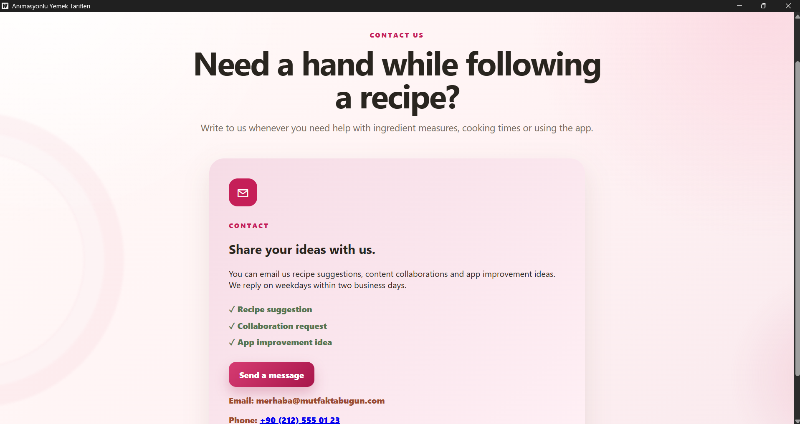

# Mutfakta Bugün

Her yemeğin kendi değişkenleri, hesaplamaları, kararları ve döngüleri bulunan bağımsız bir Lua programı olarak çalıştığı Wails masaüstü uygulaması.

- Go: Lua coroutine oturumları ve güvenli UI fonksiyon köprüsü
- Lua: 22 bağımsız tarif algoritması
- React: Lua'nın istediği dialog, liste, sayaç, ilerleme ve sonuç arayüzleri
- JSON: her tarif için ayrı metadata dosyası

Uygulama kaynakları `yemek-tarifi-uygulamasi` klasöründedir.

## Ekran Görüntüleri

### Ana sayfa

### Tarif listesi

### Tarif detayları

### Adım adım pişirme

### İletişim

